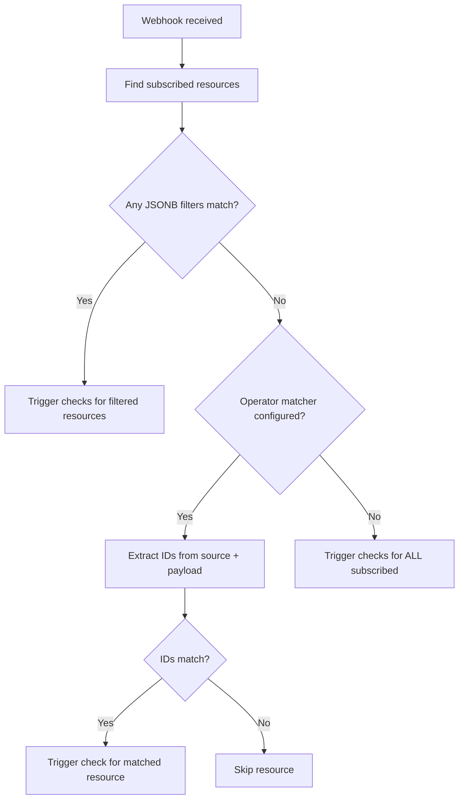

# Shared Webhooks for Concourse CI

## Overview

Shared webhooks enable a single team-scoped webhook endpoint to trigger resource checks across multiple pipelines. Instead of configuring a webhook token per resource, operators create team-level webhooks that resources subscribe to via pipeline configuration.

This implementation is based on [RFC #110](https://github.com/concourse/rfcs/pull/110) and the approach from [PR #7445](https://github.com/concourse/concourse/pull/7445).

---

## Quick Start

### 1. Create a webhook

**Without HMAC secret** (token-in-URL authentication):
```bash
fly -t ci set-webhook --webhook github-org --type github
```
Returns: `https://ci.example.com/api/v1/teams/main/webhooks/github-org?token=abc123xyz`

**With HMAC secret** (recommended for production):
```bash
fly -t ci set-webhook --webhook github-org --type github --secret "my-secret-token"
```
Returns: `https://ci.example.com/api/v1/teams/main/webhooks/github-org`

> When a secret is configured, `?token=` is **deliberately omitted** from the URL. HMAC is the sole authentication mechanism — there is no token fallback. This prevents the token from leaking in logs, proxy records, and GitHub's webhook delivery history.

### 2. Subscribe resources in pipeline config

```yaml
resources:
  - name: my-repo
    type: git
    source:
      uri: https://github.com/example/api-service
    webhooks:
      - type: github
```

### 3. Configure the external service

In GitHub (Organization → Settings → Webhooks → Add webhook):
- **Payload URL**: The URL from step 1
- **Content type**: `application/json`
- **Secret**: The HMAC secret (if configured)
- **Events**: Select relevant events (e.g. "Push events")

---

## Configuration Options

### Pipeline Config — Resource Subscription

Resources declare webhook subscriptions via the `webhooks` field:

````carousel
```yaml
# Option A: Minimal (requires operator-configured matchers)
resources:
  - name: my-repo
    type: git
    source:
      uri: https://github.com/example/repo
    webhooks:
      - type: github
```
<!-- slide -->
```yaml
# Option B: Explicit JSONB filter (works without operator config)
resources:
  - name: my-repo
    type: git
    source:
      uri: https://github.com/example/repo
    webhooks:
      - type: github
        filter:
          repository:
            full_name: example/repo
```
<!-- slide -->
```yaml
# Option C: Multiple webhook subscriptions
resources:
  - name: my-repo
    type: git
    source:
      uri: https://github.com/example/repo
    webhooks:
      - type: github
      - type: custom-ci
```
<!-- slide -->
```yaml
# Traditional per-resource webhook (unchanged, still supported)
resources:
  - name: my-repo
    type: git
    source:
      uri: https://github.com/example/repo
    webhook_token: my-secret-token
```
````

### Operator Config — Webhook Matchers

Operators configure webhook matchers in a **dedicated YAML file** referenced by `CONCOURSE_WEBHOOK_MATCHERS`. Each webhook type has a **list of rules** — all applicable rules must match (AND logic). If a resource doesn't have a particular source field set, that rule is skipped (wildcard).

```yaml
# webhook-matchers.yml — configured via CONCOURSE_WEBHOOK_MATCHERS
git:
  github:
    signature_header: X-Hub-Signature-256
    rules:
      - source_field: uri
        source_pattern: 'github\.com/(.+?)(?:\.git)?$'   # extract "owner/repo" from URI
        payload_field: repository.full_name
      - source_field: branch
        payload_field: ref
        payload_pattern: 'refs/heads/(.+)'               # extract branch name from "refs/heads/main"
      - source_field: tag_filter
        payload_field: ref
        payload_pattern: 'refs/tags/(.+)'                # extract tag from "refs/tags/v1.0.0"
        source_is_pattern: true                          # tag_filter value is a regex — match against tag
  gitlab:
    signature_header: X-Gitlab-Token
    signature_algo: plain                                # GitLab sends the token directly, not HMAC
    rules:
      - source_field: uri
        source_pattern: 'gitlab\.com/(.+?)(?:\.git)?$'
        payload_field: project.path_with_namespace
      - source_field: branch
        payload_field: ref
        payload_pattern: 'refs/heads/(.+)'

registry-image:
  dockerhub:
    rules:
      - source_field: repository
        payload_field: repository.repo_name
```

#### How Rules Are Evaluated (per resource)

For each rule in the list:

| Resource has `source_field`? | Result |
|---|---|
| **No** | Rule is **skipped** — resource is not constrained on this dimension (wildcard) |
| **Yes, matches payload** | Rule **passes** |
| **Yes, doesn't match** | Rule **fails** → resource NOT triggered |

All non-skipped rules must pass. **AND semantics across dimensions.**

#### Outcome examples for git/github

| Resource config | Push to `main` | Push to `develop` | Tag `v1.0.0` |
|---|---|---|---|
| `uri` only | ✅ triggered | ✅ triggered | ✅ triggered |
| `uri` + `branch: main` | ✅ triggered | ❌ not triggered | ❌ not triggered |
| `uri` + `tag_filter: v.*` | ❌ not triggered | ❌ not triggered | ✅ triggered |
| `uri` + `branch: main` + `tag_filter: v.*` | ✅ triggered | ❌ not triggered | ✅ triggered |

#### Matcher Rule Fields

| Field | Description |
|---|---|
| `source_field` | Key in resource's `source` config (e.g. `uri`, `branch`, `tag_filter`) |
| `source_pattern` | Optional regex; first capture group used as identifier |
| `payload_field` | Dot-path into webhook JSON payload (e.g. `repository.full_name`, `ref`) |
| `payload_pattern` | Optional regex applied to payload value; first capture group used |
| `source_is_pattern` | If `true`, the source value is treated as a regex tested against extracted payload value. Use for `tag_filter`, `tag_regexp` etc. |

#### Signature Validation Fields (per webhook type, not per rule)

| Field | Description |
|---|---|
| `signature_header` | HTTP header carrying the signature (e.g. `X-Hub-Signature-256`, `X-Gitlab-Token`) |
| `signature_algo` | How to validate: `hmac-sha256` (default, GitHub/Bitbucket) or `plain` (GitLab — header IS the secret) |

#### Service Reference

| Service | signature_header | signature_algo | Notes |
|---|---|---|---|
| GitHub | `X-Hub-Signature-256` | `hmac-sha256` | `sha256=<hex>` format |
| Bitbucket | `X-Hub-Signature` | `hmac-sha256` | Same `sha256=<hex>` format |
| GitLab | `X-Gitlab-Token` | `plain` | Header value **is** the secret |
| DockerHub | — | — | No signature; use token-in-URL mode |
| Quay.io | — | — | No signature; use token-in-URL mode |
| Artifactory | varies | `hmac-sha256` or `plain` | Depends on webhook settings |

---

## Authentication

The authentication mode is determined exclusively by whether a secret is configured. The two modes are **mutually exclusive** — there is no fallback between them.

### Mode 1: HMAC Signature (secret configured — recommended)

When `fly set-webhook --secret` is set:
- `?token=` is **omitted from the URL entirely**
- Only HMAC signature headers are accepted
- A request with no signature header is rejected with 401, even if it includes `?token=`

```
POST /api/v1/teams/main/webhooks/github-org
X-Hub-Signature-256: sha256=<hex-encoded HMAC-SHA256>
```

| Provider | Signature Header | Algorithm |
|---|---|---|
| GitHub / Bitbucket | `X-Hub-Signature-256` | HMAC-SHA256 |
| GitLab | `X-Gitlab-Token` | Plain (constant-time) |

### Mode 2: Token-in-URL (no secret — backward compatible)

When no secret is configured:
- `?token=` is included in the webhook URL
- The token is validated using constant-time comparison
- No HMAC validation is performed

```
POST /api/v1/teams/main/webhooks/github-org?token=abc123xyz
```

This also preserves backward compatibility with the legacy per-resource `webhook_token` field, which uses a separate endpoint (`/api/v1/webhooks?webhook_token=...`) and is unaffected by this feature.

---

## Resource Matching

When a webhook is received, Concourse determines which resources to check using a three-tier matching chain:

### Tier 1: Explicit JSONB Filter
Resources with a non-empty `filter` in their subscription are matched first using Postgres JSONB containment (`@>`). This is the most precise.

### Tier 2: Operator-Configured Matcher
If no JSONB filter matches, Concourse looks up the webhook matcher configured in the operator's `defaults.yml` for the resource's type + webhook type. It extracts an identifier from the resource's `source` config (via regex) and from the payload (via dot-path), and compares them case-insensitively.

### Tier 3: Fallback — All Subscribed
If no matcher is configured, ALL resources subscribed to the webhook type are checked. This is useful when the webhook is already scoped (e.g., configured for a single repo).



---

## Check Interval Optimization

Concourse uses two environment variables to control how often resources are polled:

| Variable | Default | Purpose |
|---|---|---|
| `CONCOURSE_RESOURCE_CHECKING_INTERVAL` | `1m` | Polling interval for resources **without** a webhook |
| `CONCOURSE_RESOURCE_WITH_WEBHOOK_CHECKING_INTERVAL` | `24h` | Polling interval for resources **with** a webhook (safety net) |

When a resource has a webhook, Concourse trusts the webhook to notify it of changes and reduces polling from every 1 minute to every 24 hours. The 24-hour poll acts as a safety net in case a webhook delivery fails.

### How it works

The check scheduler calls `resource.HasWebhook()` to decide which interval to use:

```go
// check_factory.go — interval selection logic
interval := atc.DefaultCheckInterval  // e.g. 1m

if checkable.HasWebhook() {
    interval = atc.DefaultWebhookInterval  // e.g. 24h
}
```

With shared webhooks, `HasWebhook()` returns `true` for both legacy per-resource tokens **and** shared webhook subscriptions:

```go
func (r *resource) HasWebhook() bool {
    return r.WebhookToken() != "" || len(r.config.Webhooks) > 0
}
```

### Example

```yaml
resources:
  - name: my-repo
    type: git
    source:
      uri: https://github.com/example/repo
    webhooks:
      - type: github
```

| | Without `webhooks:` | With `webhooks:` |
|---|---|---|
| `HasWebhook()` | `false` | `true` |
| Polling interval | Every 1 minute | Every 24 hours |
| Checks per day | **1,440** | **1** + webhook-triggered |

For a deployment with 100 pipeline resources subscribed to shared webhooks, this reduces polling from **144,000 checks/day** to **100 checks/day** plus only the webhook-triggered checks when changes actually happen.

---

## API Reference

| Method | Path | Auth | Description |
|---|---|---|---|
| `PUT` | `/api/v1/teams/:team_name/webhooks/:webhook_name` | Authorized | Create/update webhook |
| `DELETE` | `/api/v1/teams/:team_name/webhooks/:webhook_name` | Authorized | Delete webhook |
| `GET` | `/api/v1/teams/:team_name/webhooks` | Authorized | List webhooks |
| `POST` | `/api/v1/teams/:team_name/webhooks/:webhook_name` | Token/HMAC | Receive webhook event |

### Set Webhook Request

```json
{
  "type": "github",
  "secret": "optional-hmac-secret"
}
```

### Set Webhook Response

```json
{
  "id": 1,
  "name": "github-org",
  "type": "github",
  "token": "abc123xyz",
  "secret": "[configured]",
  "team_id": 1,
  "url": "https://ci.example.com/api/v1/teams/main/webhooks/github-org?token=abc123xyz"
}
```

### Receive Webhook Response

```json
{
  "checks_triggered": 3,
  "build": {
    "id": 42,
    "name": "check",
    "status": "started"
  }
}
```

---

## `fly` CLI Commands

```bash
# Create/update a webhook — minimal (token-in-URL auth)
fly -t ci set-webhook --webhook github-org --type github

# With HMAC secret (recommended — omits ?token= from URL)
fly -t ci set-webhook --webhook github-org --type github --secret "my-secret"

# GitLab: use 'plain' algo (header value IS the secret, no sha256= prefix)
fly -t ci set-webhook \
  --webhook gitlab-org \
  --type gitlab \
  --secret "my-gitlab-token" \
  --signature-header X-Gitlab-Token \
  --signature-algo plain

# With matcher rules from a YAML file
# rules.yml: list of source_field/payload_field pairs (same schema as CONCOURSE_WEBHOOK_MATCHERS rules:)
fly -t ci set-webhook \
  --webhook github-org \
  --type github \
  --secret "my-secret" \
  --signature-header X-Hub-Signature-256 \
  --rules-file ./github-rules.yml

# Example github-rules.yml:
# - source_field: uri
#   source_pattern: 'github\.com/(.+?)(?:\.git)?$'
#   payload_field: repository.full_name
# - source_field: branch
#   payload_field: ref
#   payload_pattern: 'refs/heads/(.+)'
# - source_field: tag_filter
#   payload_field: ref
#   payload_pattern: 'refs/tags/(.+)'
#   source_is_pattern: true

# List all webhooks for the team
fly -t ci webhooks

# Destroy a webhook (interactive confirmation)
fly -t ci destroy-webhook --webhook github-org [--non-interactive]
```

> **Operator choice:** Use `CONCOURSE_WEBHOOK_MATCHERS` (config file) for global defaults across all teams.
> Use `fly set-webhook --rules-file` for per-team or per-webhook custom matchers.

---

## Files Changed

### Phase 1 — Core Infrastructure

| File | Change |
|---|---|
| [1771500000_add_shared_webhooks.up.sql](file:///home/espirite/WORK/concourse/atc/db/migration/migrations/1771500000_add_shared_webhooks.up.sql) | Creates `webhooks` and `resource_webhook_subscriptions` tables |
| [webhook.go (atc)](file:///home/espirite/WORK/concourse/atc/webhook.go) | `atc.Webhook` and `atc.WebhookSubscription` types |
| [config.go](file:///home/espirite/WORK/concourse/atc/config.go) | Added `Webhooks` field to `ResourceConfig` |
| [webhook.go (db)](file:///home/espirite/WORK/concourse/atc/db/webhook.go) | DB model, CRUD, JSONB matching, subscription persistence |
| [team.go](file:///home/espirite/WORK/concourse/atc/db/team.go) | Added webhook methods to Team interface |
| [server.go](file:///home/espirite/WORK/concourse/atc/api/webhookserver/server.go) | API handlers |
| [routes.go](file:///home/espirite/WORK/concourse/atc/routes.go) | Route definitions |
| [handler.go](file:///home/espirite/WORK/concourse/atc/api/handler.go) | Handler wiring |
| [api_auth_wrappa.go](file:///home/espirite/WORK/concourse/atc/wrappa/api_auth_wrappa.go) | Access control |
| [reject_archived_wrappa.go](file:///home/espirite/WORK/concourse/atc/wrappa/reject_archived_wrappa.go) | Archived pipeline pass-through |
| [set_webhook.go](file:///home/espirite/WORK/concourse/fly/commands/set_webhook.go) | `fly set-webhook` command |
| [destroy_webhook.go](file:///home/espirite/WORK/concourse/fly/commands/destroy_webhook.go) | `fly destroy-webhook` command |
| [webhooks.go (fly)](file:///home/espirite/WORK/concourse/fly/commands/webhooks.go) | `fly webhooks` command |
| [fly.go](file:///home/espirite/WORK/concourse/fly/commands/fly.go) | Command registration |
| [webhooks.go (client)](file:///home/espirite/WORK/concourse/go-concourse/concourse/webhooks.go) | Client methods |
| [team.go (client)](file:///home/espirite/WORK/concourse/go-concourse/concourse/team.go) | Team interface |

### Phase 2 — Enhanced Features

| File | Change |
|---|---|
| [webhook_matcher.go](file:///home/espirite/WORK/concourse/atc/webhook_matcher.go) | `WebhookMatcher` type with eager regex compilation, dot-path payload extraction, `NewWebhookMatcher` constructor, matcher registry |
| [webhook_matcher_test.go](file:///home/espirite/WORK/concourse/atc/webhook_matcher_test.go) | 9 unit tests for matcher |
| [hmac_test.go](file:///home/espirite/WORK/concourse/atc/api/webhookserver/hmac_test.go) | 5 unit tests for HMAC-SHA256 validation |
| [1771500001_add_webhook_secret.up.sql](file:///home/espirite/WORK/concourse/atc/db/migration/migrations/1771500001_add_webhook_secret.up.sql) | Adds `secret` + `nonce` columns to `webhooks` table |
| [1771500002_add_webhook_matcher_fields.up.sql](file:///home/espirite/WORK/concourse/atc/db/migration/migrations/1771500002_add_webhook_matcher_fields.up.sql) | Added flat matcher columns (now superseded by 1771500003) |
| [1771500003_add_webhook_matcher_rules.up.sql](file:///home/espirite/WORK/concourse/atc/db/migration/migrations/1771500003_add_webhook_matcher_rules.up.sql) | Replaced flat columns with `matcher_rules JSONB` for multi-rule support |
| [1771500004_add_webhook_signature_algo.up.sql](file:///home/espirite/WORK/concourse/atc/db/migration/migrations/1771500004_add_webhook_signature_algo.up.sql) | Adds `signature_algo TEXT DEFAULT 'hmac-sha256'` |
| [command.go](file:///home/espirite/WORK/concourse/atc/atccmd/command.go) | New `--webhook-matchers` / `CONCOURSE_WEBHOOK_MATCHERS` flag; YAML loaded as `rules:` list |
| [webhook.go (db)](file:///home/espirite/WORK/concourse/atc/db/webhook.go) | `WebhookConfig` uses `Rules []atc.WebhookMatcherRule`; stored as JSONB; `Matcher()` builds from rules |
| [webhook.go (atc)](file:///home/espirite/WORK/concourse/atc/webhook.go) | `atc.Webhook` type with `Rules []WebhookMatcherRule` + `SignatureHeader` |
| [server.go](file:///home/espirite/WORK/concourse/atc/api/webhookserver/server.go) | Updated for new fields; per-webhook DB matcher takes priority over global config |
| [set_webhook.go](file:///home/espirite/WORK/concourse/fly/commands/set_webhook.go) | `--rules-file` flag (YAML list of rules); `--secret` and `--signature-header` remain flat |
| [webhooks.go (client)](file:///home/espirite/WORK/concourse/go-concourse/concourse/webhooks.go) | `WebhookConfig` uses `Rules []atc.WebhookMatcherRule` |
| [resource.go](file:///home/espirite/WORK/concourse/atc/db/resource.go) | `HasWebhook()` now includes shared webhook subscriptions |

### Phase 3 — Observability

| File | Change |
|---|---|
| [webhook_metrics.go](file:///home/espirite/WORK/concourse/atc/metric/webhook_metrics.go) | New `WebhookReceived` metric type with duration, match type, and checks triggered |
| [prometheus.go](file:///home/espirite/WORK/concourse/atc/metric/emitter/prometheus.go) | Added webhook metrics: requests_total, request_duration_seconds, resources_matched_total, checks_triggered_total |
| [server.go](file:///home/espirite/WORK/concourse/atc/api/webhookserver/server.go) | Instrumented `ReceiveWebhook` to emit metrics; added `findMatchingResourcesWithType` to track match type |

---

## Design Decisions

| Decision | Choice | Rationale |
|---|---|---|
| Manual subscriptions | Resources declare `webhooks:` in config | Explicit opt-in; clear which resources receive webhook events |
| JSONB containment | Postgres `@>` operator | Native, indexable, efficient for filter matching |
| Three-tier matching | Filter → Matcher → Fallback | Covers all use cases: precise, convenient, and simple |
| HMAC and token are exclusive | Modes do not mix | Prevents accidental token fallback when secret is configured |
| `?token=` omitted when secret set | URL doesn't carry the token | Prevents token leakage in logs, proxies, delivery history |
| Constant-time comparison | `hmac.Equal()` everywhere | Prevents timing attacks on both HMAC and token validation |
| Separate matchers config file | `CONCOURSE_WEBHOOK_MATCHERS` flag | Prevents matchers being merged into resource `source`, which would corrupt the check script input |
| Case-insensitive matching | `strings.EqualFold` | Handles URI case variations (e.g. GitHub vs github) |
| Eager regex compile | Compiled at load time | Avoids per-match recompilation; early error detection at startup |
| Encryption at rest | `conn.EncryptionStrategy()` + nonce | HMAC secrets encrypted using Concourse's existing mechanism |

---

## Observability

### Prometheus Metrics

When Prometheus is enabled, the following webhook-specific metrics are exported:

| Metric | Type | Labels | Description |
|--------|------|--------|-------------|
| `concourse_webhooks_requests_total` | Counter | `team`, `webhook_name`, `webhook_type`, `status` | Total webhook requests received (status: 2xx, 4xx, 5xx) |
| `concourse_webhooks_request_duration_seconds` | Histogram | `team`, `webhook_name`, `webhook_type`, `status` | Webhook request processing duration |
| `concourse_webhooks_resources_matched_total` | Counter | `team`, `webhook_name`, `webhook_type`, `match_type` | Resources matched by webhooks (match_type: jsonb_filter, matcher, fallback, none) |
| `concourse_webhooks_checks_triggered_total` | Counter | `team`, `webhook_name`, `webhook_type` | Resource checks triggered by webhooks |

**Example queries:**
```promql
# Webhook request rate by team
rate(concourse_webhooks_requests_total[5m])

# 95th percentile webhook duration
histogram_quantile(0.95, rate(concourse_webhooks_request_duration_seconds_bucket[5m]))

# Match efficiency (jsonb vs matcher vs fallback)
sum by (match_type) (rate(concourse_webhooks_resources_matched_total[5m]))

# Checks triggered per webhook
rate(concourse_webhooks_checks_triggered_total[5m])
```

---

## Known Limitations

1. **Payload pass-through to check** — Not yet implemented. Resource types cannot currently access the webhook payload during `check`.
2. **Team-scoped only** — Global (cross-team) webhooks are not implemented.

---

## Build Verification

✅ `go build ./atc/... ./fly/... ./go-concourse/...` — **passes with zero errors**

✅ `go test ./atc/ -run TestWebhookMatcher` — **14/14 tests pass** (added branch mismatch, tag_filter pattern, skip-if-absent wildcard tests)

✅ `go generate ./atc/db/...` — **FakeTeam and FakeWebhook regenerated** (with `WebhookConfig`/`Rules` signatures)

✅ `go generate ./go-concourse/concourse/...` — **FakeTeam (concourse) regenerated** with `WebhookConfig` signature
