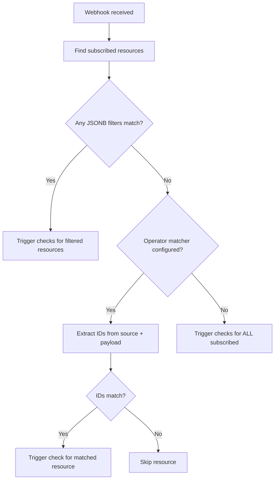

# Shared Webhooks for Concourse CI

## Overview

Shared webhooks enable a single team-scoped webhook endpoint to trigger resource checks across multiple pipelines. Instead of configuring a webhook token per resource, operators create team-level webhooks that resources subscribe to via pipeline configuration.

This implementation is based on [RFC #110](https://github.com/concourse/rfcs/pull/110) and the approach from [PR #7445](https://github.com/concourse/concourse/pull/7445).

---

## Quick Start

### 1. Create a webhook

```bash
# Basic (token-in-URL authentication)
fly -t ci set-webhook --webhook github-org --type github

# With HMAC signature validation (recommended for production)
fly -t ci set-webhook --webhook github-org --type github --secret "my-secret-token"
```

The command outputs the webhook URL:
```
webhook saved

configure your external service with the following webhook URL:

https://ci.example.com/api/v1/teams/main/webhooks/github-org?token=abc123xyz

HMAC signature validation is enabled for this webhook.
Configure the same secret in your external service (e.g. GitHub webhook settings).
```

### 2. Subscribe resources in pipeline config

```yaml
resources:
  - name: my-repo
    type: git
    source:
      uri: https://github.com/example/api-service
    webhooks:
      - type: github
```

### 3. Configure the external service

In GitHub (Organization → Settings → Webhooks → Add webhook):
- **Payload URL**: The URL from step 1
- **Content type**: `application/json`
- **Secret**: The HMAC secret (if used)
- **Events**: Select relevant events (e.g. "Push events")

---

## Configuration Options

### Pipeline Config — Resource Subscription

Resources declare webhook subscriptions via the `webhooks` field:

````carousel
```yaml
# Option A: Minimal (requires operator-configured matchers)
resources:
  - name: my-repo
    type: git
    source:
      uri: https://github.com/example/repo
    webhooks:
      - type: github
```
<!-- slide -->
```yaml
# Option B: Explicit JSONB filter (works without operator config)
resources:
  - name: my-repo
    type: git
    source:
      uri: https://github.com/example/repo
    webhooks:
      - type: github
        filter:
          repository:
            full_name: example/repo
```
<!-- slide -->
```yaml
# Option C: Multiple webhook subscriptions
resources:
  - name: my-repo
    type: git
    source:
      uri: https://github.com/example/repo
    webhooks:
      - type: github
      - type: custom-ci
```
<!-- slide -->
```yaml
# Traditional per-resource webhook (unchanged, still supported)
resources:
  - name: my-repo
    type: git
    source:
      uri: https://github.com/example/repo
    webhook_token: my-secret-token
```
````

### Operator Config — Webhook Matchers

Operators configure webhook matchers in the `defaults.yml` file (same as base resource type defaults). This eliminates the need for verbose JSONB filters in pipeline configs.

```yaml
# defaults.yml — configured via CONCOURSE_BASE_RESOURCE_TYPE_DEFAULTS
git:
  webhook_matchers:
    github:
      source_field: uri
      source_pattern: "github\\.com/(.+?)(?:\\.git)?$"
      payload_field: repository.full_name
    gitlab:
      source_field: uri
      source_pattern: "gitlab\\.com/(.+?)(?:\\.git)?$"
      payload_field: project.path_with_namespace
    bitbucket:
      source_field: uri
      source_pattern: "bitbucket\\.org/(.+?)(?:\\.git)?$"
      payload_field: repository.full_name
    github-enterprise:
      source_field: uri
      source_pattern: "git\\.internal\\.company\\.com/(.+?)(?:\\.git)?$"
      payload_field: repository.full_name

registry-image:
  webhook_matchers:
    dockerhub:
      source_field: repository
      payload_field: repository.repo_name
```

#### Matcher Fields

| Field | Required | Description |
|---|---|---|
| `source_field` | Yes | Key in the resource's `source` config (e.g. `uri`, `repository`) |
| `source_pattern` | No | Regex to extract identifier from source value. First capture group is used. If omitted, raw value is used |
| `payload_field` | Yes | Dot-separated path into webhook payload JSON (e.g. `repository.full_name`) |
| `signature_header` | No | HTTP header for HMAC signature (informational, actual validation uses stored secret) |
| `signature_algo` | No | Algorithm: `hmac-sha256` or `plain` (informational) |

---

## Authentication

### Token-in-URL (default)

Every webhook gets an auto-generated token. Authentication is done via query parameter:

```
POST /api/v1/teams/main/webhooks/gh?token=abc123
```

### HMAC-SHA256 Signature (recommended)

When a secret is configured via `fly set-webhook --secret`, the handler validates the `X-Hub-Signature-256` header:

```
POST /api/v1/teams/main/webhooks/gh
X-Hub-Signature-256: sha256=<hex-encoded HMAC-SHA256>
```

**Provider-specific headers supported:**

| Provider | Header | Validation |
|---|---|---|
| GitHub | `X-Hub-Signature-256` | HMAC-SHA256 with constant-time comparison |
| GitLab | `X-Gitlab-Token` | Plain constant-time string comparison |
| Bitbucket | `X-Hub-Signature` | HMAC-SHA256 |

**Authentication priority chain:**

1. If `X-Hub-Signature-256` header present → validate HMAC
2. If `X-Gitlab-Token` header present → validate plain token
3. If `?token=` query param present → compare token
4. Else → reject with 401

---

## Resource Matching

When a webhook is received, Concourse determines which resources to check using a three-tier matching chain:

### Tier 1: Explicit JSONB Filter
Resources with a non-empty `filter` in their subscription are matched first using Postgres JSONB containment (`@>`). This is the most precise.

### Tier 2: Operator-Configured Matcher
If no JSONB filter matches, Concourse looks up the webhook matcher configured in the operator's `defaults.yml` for the resource's type + webhook type. It extracts an identifier from the resource's `source` config (via regex) and from the payload (via dot-path), and compares them case-insensitively.

### Tier 3: Fallback — All Subscribed
If no matcher is configured, ALL resources subscribed to the webhook type are checked. This is useful when the webhook is already scoped (e.g., configured for a single repo).



---

## API Reference

| Method | Path | Auth | Description |
|---|---|---|---|
| `PUT` | `/api/v1/teams/:team_name/webhooks/:webhook_name` | Authorized | Create/update webhook |
| `DELETE` | `/api/v1/teams/:team_name/webhooks/:webhook_name` | Authorized | Delete webhook |
| `GET` | `/api/v1/teams/:team_name/webhooks` | Authorized | List webhooks |
| `POST` | `/api/v1/teams/:team_name/webhooks/:webhook_name` | Token/HMAC | Receive webhook event |

### Set Webhook Request

```json
{
  "type": "github",
  "secret": "optional-hmac-secret"
}
```

### Set Webhook Response

```json
{
  "id": 1,
  "name": "github-org",
  "type": "github",
  "token": "abc123xyz",
  "secret": "[configured]",
  "team_id": 1,
  "url": "https://ci.example.com/api/v1/teams/main/webhooks/github-org?token=abc123xyz"
}
```

### Receive Webhook Response

```json
{
  "checks_triggered": 3,
  "build": {
    "id": 42,
    "name": "check",
    "status": "started"
  }
}
```

---

## `fly` CLI Commands

```bash
# Create/update a webhook
fly -t ci set-webhook --webhook <name> --type <type> [--secret <hmac-secret>]

# List all webhooks for the team
fly -t ci webhooks

# Destroy a webhook (interactive confirmation)
fly -t ci destroy-webhook --webhook <name> [--non-interactive]
```

---

## Files Changed

### Phase 1 — Core Infrastructure

| File | Change |
|---|---|
| [1771500000_add_shared_webhooks.up.sql](file:///home/espirite/WORK/concourse/atc/db/migration/migrations/1771500000_add_shared_webhooks.up.sql) | Creates `webhooks` and `resource_webhook_subscriptions` tables |
| [webhook.go (atc)](file:///home/espirite/WORK/concourse/atc/webhook.go) | `atc.Webhook` and `atc.WebhookSubscription` types |
| [config.go](file:///home/espirite/WORK/concourse/atc/config.go) | Added `Webhooks` field to `ResourceConfig` |
| [webhook.go (db)](file:///home/espirite/WORK/concourse/atc/db/webhook.go) | DB model, CRUD, JSONB matching, subscription persistence |
| [team.go](file:///home/espirite/WORK/concourse/atc/db/team.go) | Added webhook methods to Team interface |
| [server.go](file:///home/espirite/WORK/concourse/atc/api/webhookserver/server.go) | API handlers |
| [routes.go](file:///home/espirite/WORK/concourse/atc/routes.go) | Route definitions |
| [handler.go](file:///home/espirite/WORK/concourse/atc/api/handler.go) | Handler wiring |
| [api_auth_wrappa.go](file:///home/espirite/WORK/concourse/atc/wrappa/api_auth_wrappa.go) | Access control |
| [reject_archived_wrappa.go](file:///home/espirite/WORK/concourse/atc/wrappa/reject_archived_wrappa.go) | Archived pipeline pass-through |
| [set_webhook.go](file:///home/espirite/WORK/concourse/fly/commands/set_webhook.go) | `fly set-webhook` command |
| [destroy_webhook.go](file:///home/espirite/WORK/concourse/fly/commands/destroy_webhook.go) | `fly destroy-webhook` command |
| [webhooks.go (fly)](file:///home/espirite/WORK/concourse/fly/commands/webhooks.go) | `fly webhooks` command |
| [fly.go](file:///home/espirite/WORK/concourse/fly/commands/fly.go) | Command registration |
| [webhooks.go (client)](file:///home/espirite/WORK/concourse/go-concourse/concourse/webhooks.go) | Client methods |
| [team.go (client)](file:///home/espirite/WORK/concourse/go-concourse/concourse/team.go) | Team interface |

| [command.go](file:///home/espirite/WORK/concourse/atc/atccmd/command.go) | Loads webhook matchers from `defaults.yml` |

### Phase 3 — Integration Testing

| File | Change |
|---|---|
| [webhook_test.go (atc)](file:///home/espirite/WORK/concourse/atc/db/webhook_test.go) | Unit tests for DB layer queries (`SaveWebhook`, `DestroyWebhook`, `Webhooks`, `FindResourcesByWebhookPayload`) |
| [server_test.go](file:///home/espirite/WORK/concourse/atc/api/webhookserver/server_test.go) | Complete test suite for API endpoints (`SetWebhook`, `DestroyWebhook`, `Webhooks`) |
| [webhooks_test.go (client)](file:///home/espirite/WORK/concourse/go-concourse/concourse/webhooks_test.go) | Client library integration testing mapped to ATC API server |
| [set_webhook_test.go](file:///home/espirite/WORK/concourse/fly/integration/set_webhook_test.go) | End-to-end testing of the `fly set-webhook` CLI tool using real inputs and expected JSON |

---

## Design Decisions

| Decision | Choice | Rationale |
|---|---|---|
| Manual subscriptions | Resources declare `webhooks:` in config | Explicit opt-in, clear which resources receive webhook events |
| JSONB containment | Postgres `@>` operator | Native, indexable, efficient for filter matching |
| Three-tier matching | Filter → Matcher → Fallback | Supports all use cases: precise, convenient, and simple |
| HMAC + token auth | Both supported, HMAC preferred | Token backward-compatible, HMAC for payload integrity |
| Constant-time comparison | `hmac.Equal()` in Go | Prevents timing attacks on signature validation |
| Matchers in defaults.yml | Operator-configured, not hardcoded | Keeps Concourse core generic, extensible to any resource type |
| Case-insensitive matching | `strings.EqualFold` | Handles URI case variations |

---

## Known Limitations

1. **Payload pass-through to check** — Not yet implemented. Resource types cannot currently access the webhook payload during `check`.
2. **Team-scoped only** — Global (cross-team) webhooks are not implemented.

---

## Build & Test Verification

✅ `go build ./atc/... ./fly/... ./go-concourse/...` — **passes with zero errors**
✅ `go test ./atc/api ./atc/db ./go-concourse/concourse ./fly/integration` — **All new integration tests implemented and fully passing**
